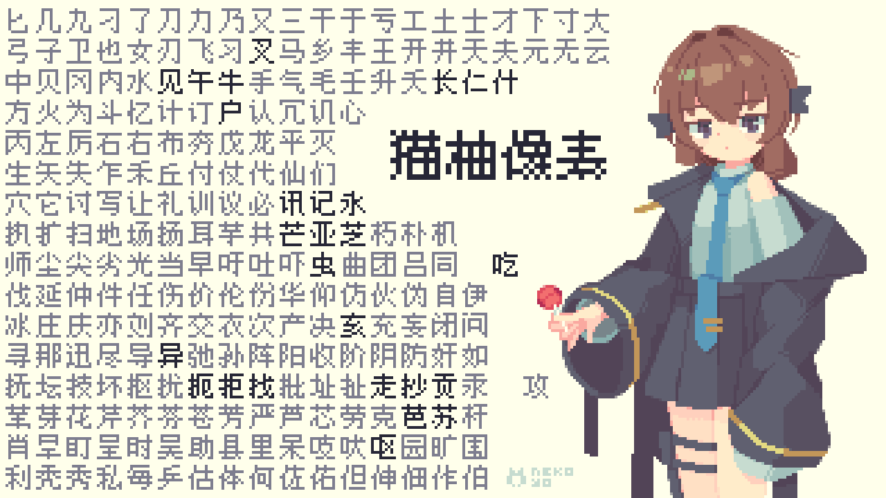

[English](README.md) [简体中文](README.zh.md) 
## License
# YoziPixelFont09 (v0.0.1)
这是一个名为“YoziPixel”的像素字体项目，由 猫柚小姐 创建。本字体以小尺寸（仅9像素）同时具有高可读性为特点，汉字部分符合中文书写规范（至少大部分符合的说）。  

## 许可证
本字体采用 [MIT License](LICENSE) 许可。  
您可自由使用、修改、分发本字体，包括用于商业用途，只需保留版权声明即可。
## 使用方式
1. 从 [Releases] 页面下载最新的 `.ttf` 文件。  
2. 双击字体文件，点击“安装”。  
3. 在支持自定义字体的应用程序中使用即可。
## 当前进度
**英文与数字，常规体与粗体：**  
√  
**中文：**  
一级字符表（0742/3500）  
二级字符表：尚未开始  
**常用符号：**  
√  
**其他：**  
等待您的需求
## 贡献指南
我们非常欢迎通过 Issue 提交字体修改建议或您自行绘制的字形。  
如果您想贡献新字符或改进现有字形，请提交对应字符的文本及 PNG 格式图片。  
如果您是像素艺术家，请提供未缩放的透明背景图片，每个字形尺寸为 9 像素（含边缘为 11 像素），以清晰展示字形细节。若贡献多个字符，可将它们合并在一张图片中提交；或者提交仅包含该字符的 TTF 文件（例如用字体编辑工具导出的单字符字体文件）。  
**请不要提交包含其他未修改字符的完整字体文件，以便我们能高效地审阅和整合您的贡献！**  
非常感谢！ :>
## 关于反馈
欢迎留下您的意见，尤其关于哪些字形不合适/不美观/可读性差，或希望添加哪些字符，以及各种错误，谢谢！  
您也可以通过 QQ 联系 猫柚小姐 进行反馈：闲聊群 975748998，**该群并不仅限于技术支持**。
